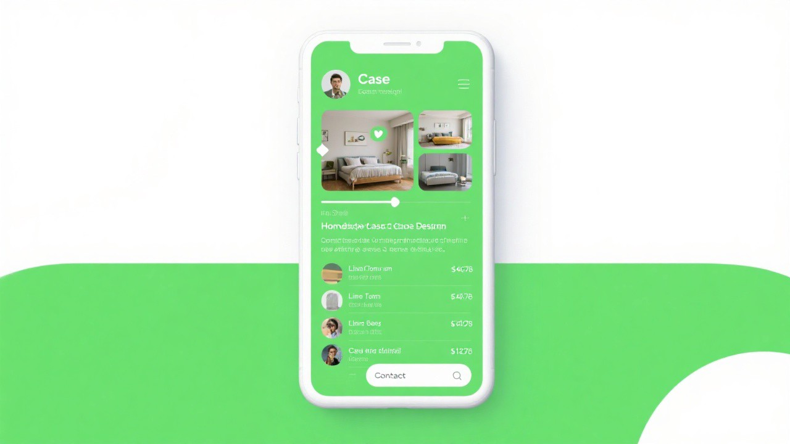
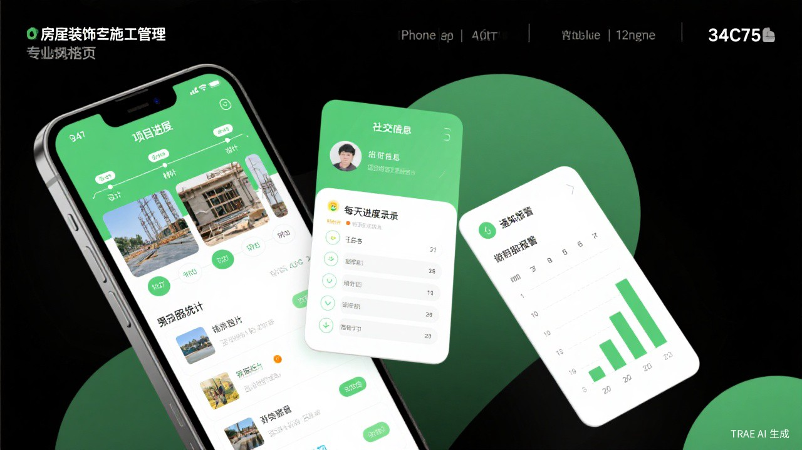

# 🏗️ Project Builder

> 一键从想法到原型：需求文档 → 流程图 → 设计参考 → HTML 可交互原型

[](https://opensource.org/licenses/MIT)
[](https://github.com/kapion-lim/beforeDev)

---

## ✨ 功能特性

Project Builder 是一个面向产品经理、设计师和开发者的全流程项目构建工具，能够根据一句话描述自动生成完整的项目交付物：

| 交付物 | 说明 | 状态 |
|--------|------|------|
| 📄 **需求文档** | 结构化的功能需求、用户故事、非功能需求 | ✅ 自动生成 |
| 📊 **流程图** | Mermaid 语法的系统架构图、业务流程图 | ✅ 自动生成 |
| 🎨 **设计参考图** | AI 生成的 UI 设计参考，所见即所得 | ✅ AI 生成 |
| 📱 **HTML 原型** | 可运行的 6 页交互原型，含完整假数据 | ✅ 开箱即用 |
| 📋 **页面映射表** | 60+ 条跳转规则、参数规范、埋点规范 | ✅ 自动生成 |

### 🎯 核心亮点

- **🤖 9 步引导式工作流**：每步都有确认，确保方向正确
- **🎨 5 种设计风格可选**：现代电商、简约扁平、暗黑高端、清新自然、社交活力
- **🖼️ AI 生成设计参考**：生成前先看图确认，不满意可调整
- **📱 开箱即用的原型**：纯 HTML/CSS/JS，浏览器直接打开
- **📊 丰富的假数据**：12+ 商品、10+ 评论、5+ 优惠券，内容饱满真实

---

## 🚀 快速开始

### 使用方式

在 Trae 中触发技能：

```
使用 project-builder 技能生成一个电商小程序
```

或自然语言描述：

```
我要做一个家居装修的小程序，包含案例展示、预约报价、建材商城功能
```

### 工作流程

```
步骤1️⃣ 需求收集 → 步骤2️⃣ 风格选择 → 步骤3️⃣ 设计参考确认
     ↓
步骤4️⃣ 需求文档 → 步骤5️⃣ 流程图 → 步骤6️⃣ Axure规范
     ↓
步骤7️⃣ 页面映射表 → 步骤8️⃣ HTML原型 → 步骤9️⃣ 设计稿
```

---

## 🎨 设计风格

### 5 种预设风格

| 风格 | 主色调 | 特点 | 适用场景 |
|------|--------|------|---------|
| **现代电商风** | `#ff4757` 橙红 | 活力、促销、流畅动效 | 电商、零售、团购 |
| **简约扁平风** | `#667eea` 紫蓝 | 留白、简洁、专业感 | 工具类、企业应用 |
| **暗黑高端风** | `#1a1a2e` 深色 | 沉浸、金色点缀、奢华 | 奢侈品、会员应用 |
| **清新自然风** | `#34c759` 绿色 | 圆润、柔和、亲和力 | 生活服务、健康应用 |
| **社交活力风** | `#ff2d55` 粉红 | 年轻、互动、内容化 | 社交、内容社区 |

### 设计原则

基于 [Frontend Design](https://github.com/...) 最佳实践：

- ✅ 独特字体搭配，避免 Arial/Inter/Roboto
- ✅ 大胆配色方案，避免紫色渐变+白底
- ✅ CSS 变量系统，一键切换主题
- ✅ 流畅动效，页面加载交错显示
- ✅ 意想不到的布局，打破网格

---

## 📁 项目结构

```
beforeDev/
├── 📄 SKILL.md                    # 技能文档（完整工作流程）
├── 📁 assets/                     # 设计参考图片
│   ├── design-reference-homepage.jpg
│   ├── design-reference-case-detail.jpg
│   └── design-reference-construction.jpg
├── 📁 scripts/                    # 生成脚本
│   └── generate_project.py        # 核心生成脚本
└── 📁 templates/                  # HTML 模板
    ├── index.html                 # 首页模板
    ├── cart.html                  # 购物车模板
    ├── product-detail.html        # 商品详情模板
    ├── styles.css                 # 样式系统（CSS变量）
    ├── data.js                    # 假数据模板
    └── app.js                     # 交互脚本模板
```

---

## 🎯 使用场景

### 场景一：产品经理快速出原型

> "我要做一个生鲜电商小程序"

30 秒确认需求 → 2 分钟生成完整原型，包含首页、分类、商品详情、购物车、个人中心等 6 个页面。

### 场景二：创业者向投资人演示

> "帮我做一个家居装修平台的 Demo"

一键生成需求文档 + 流程图 + 设计参考图 + 可交互原型，直接用于路演展示。

### 场景三：设计师快速探索方案

> "用简约扁平风做一个任务管理工具"

选择风格后，AI 先生成设计参考图供确认，确认后再生成完整原型。

### 场景四：开发者理解需求

> "帮我梳理这个社交 App 的业务流程"

自动生成 7 张 Mermaid 流程图，帮助开发团队快速对齐需求。

### 场景五：学生完成课程作业

> "我要交一个电商系统的课程设计"

自动生成需求文档、流程图、页面映射表、可运行原型，满足完整交付要求。

---

## 📸 效果展示

### 生成的设计参考图

| 首页参考 | 案例详情参考 | 施工管理参考 |
|---------|-------------|-------------|
|  |  |  |

### 生成的 HTML 原型页面

- **首页**：搜索栏 + Banner 轮播 + 分类入口 + 商品推荐
- **案例列表**：风格筛选 + 瀑布流展示
- **案例详情**：图片轮播 + 设计师信息 + 评论区
- **建材商城**：分类导航 + 商品列表
- **施工管理**：进度时间线 + 工地动态 + 预算跟踪
- **个人中心**：用户信息 + 数据统计 + 功能菜单

---

## 🛠️ 技术栈

| 技术 | 用途 |
|------|------|
| HTML5 | 页面结构 |
| CSS3 + CSS Variables | 样式系统，主题可配置 |
| JavaScript | 交互逻辑（轮播、筛选、弹窗） |
| Mermaid | 流程图语法 |
| AI Image Generation | 设计参考图生成 |

---

## 📝 版本历史

| 版本 | 更新内容 |
|------|---------|
| V9 Final | 整合 frontend-design 原则，完善设计参考图片生成 |
| V8 | 新增设计参考确认步骤，优化设计风格选项 |
| V7 | 添加设计风格确认步骤 |
| V6 | 完善所有页面功能和假数据 |
| V5 | 优化原型美观度 |
| V4 | 完善所有页面功能实现 |

---

## 🤝 贡献指南

欢迎提交 Issue 和 PR！

1. Fork 本仓库
2. 创建你的特性分支 (`git checkout -b feature/AmazingFeature`)
3. 提交更改 (`git commit -m 'Add some AmazingFeature'`)
4. 推送到分支 (`git push origin feature/AmazingFeature`)
5. 打开一个 Pull Request

---

## 📄 许可证

本项目基于 [MIT](LICENSE) 许可证开源。

---

## 🙏 致谢

- [Trae](https://www.trae.ai/) - AI 编程助手
- [Frontend Design](https://github.com/...) - 前端设计原则参考

---

> **一句话概括**：从想法到原型，只需一句话。
>
> *Project Builder V9 Final · Built with ❤️ and Trae*
